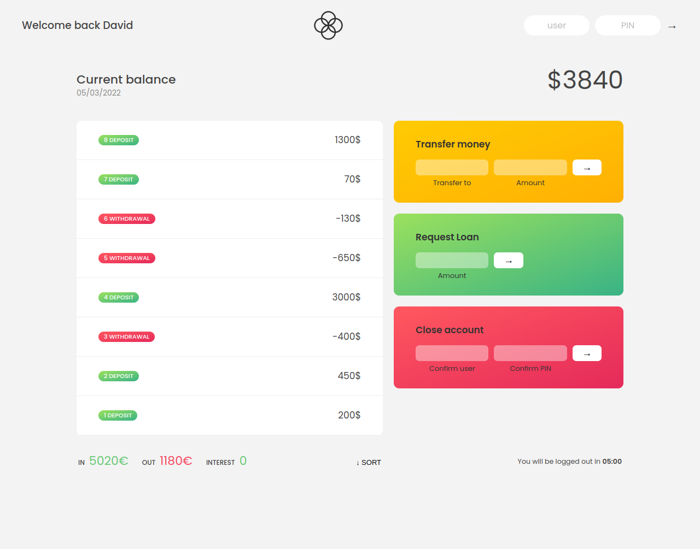

# The MoneyMan App

> This project is a bank app that handles every type of transactions a user can have regarding their money. In this app the user can check their balance, check the different types of transactions they have made over a particular period of time, request for loans and even wire funds. 

## Built with

- HTML
- CSS
- Vanilla JavaScript
- Git

## Authours 

👤 **David Ouma**

- Github: [@daudi13](https://github.com/daudi13);
- Twitter: [@davouma](https://twitter.com/davouma13);

## contributions

Contributions, issues and features requests are welcome!

Feel free to chech the [issues pages](../../issues/).

## Acknowledgements

> I would like to give special thanks to @jonasschmedtmann

## show your support 

Give a star if you like this project

## license 

This project is [MIT](./MIT.md) licensed.
